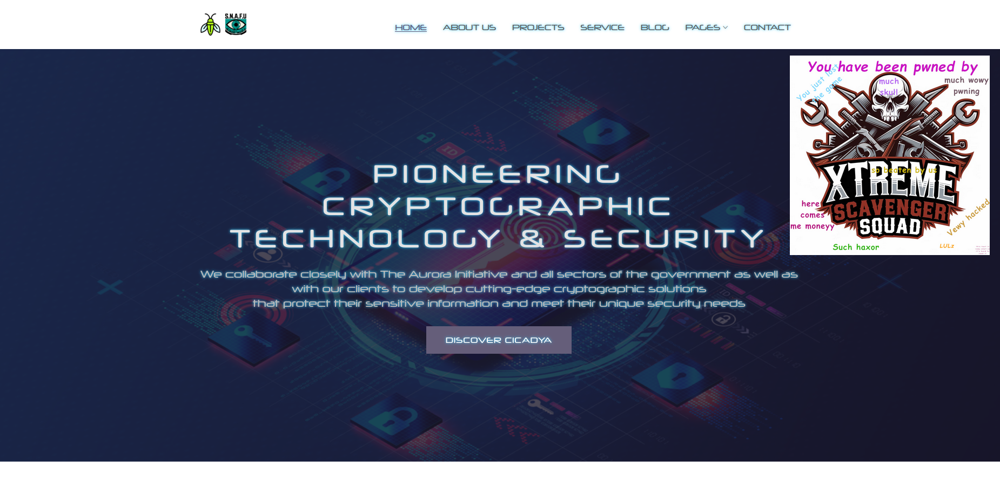
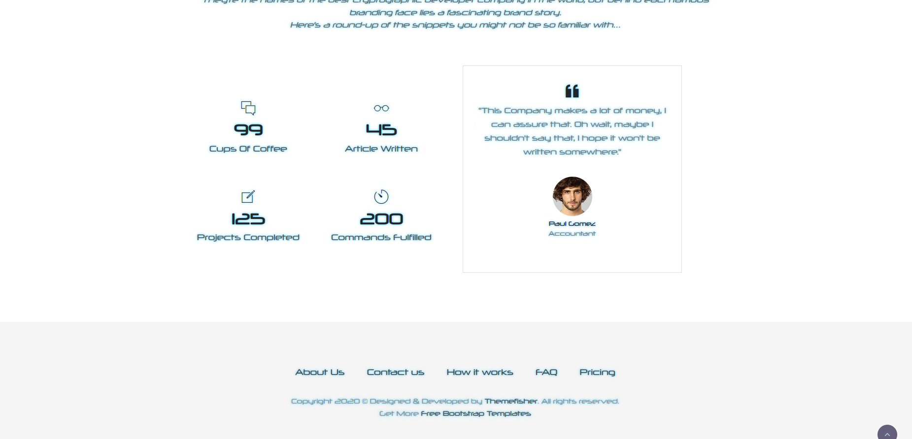
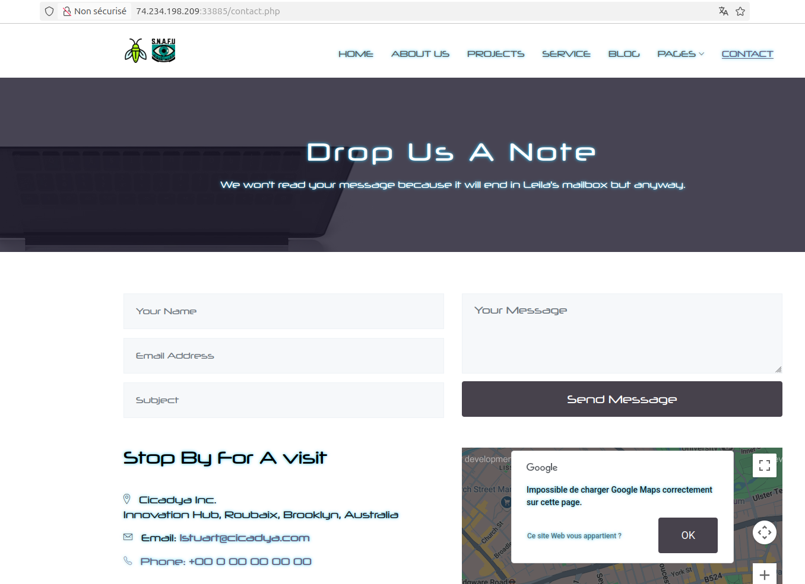
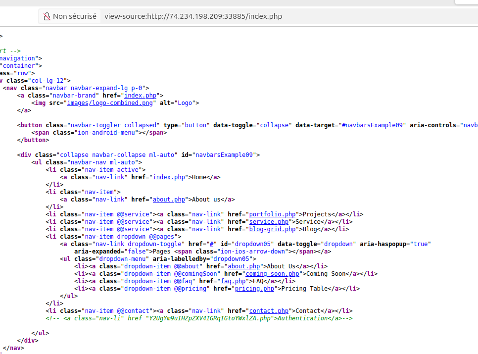
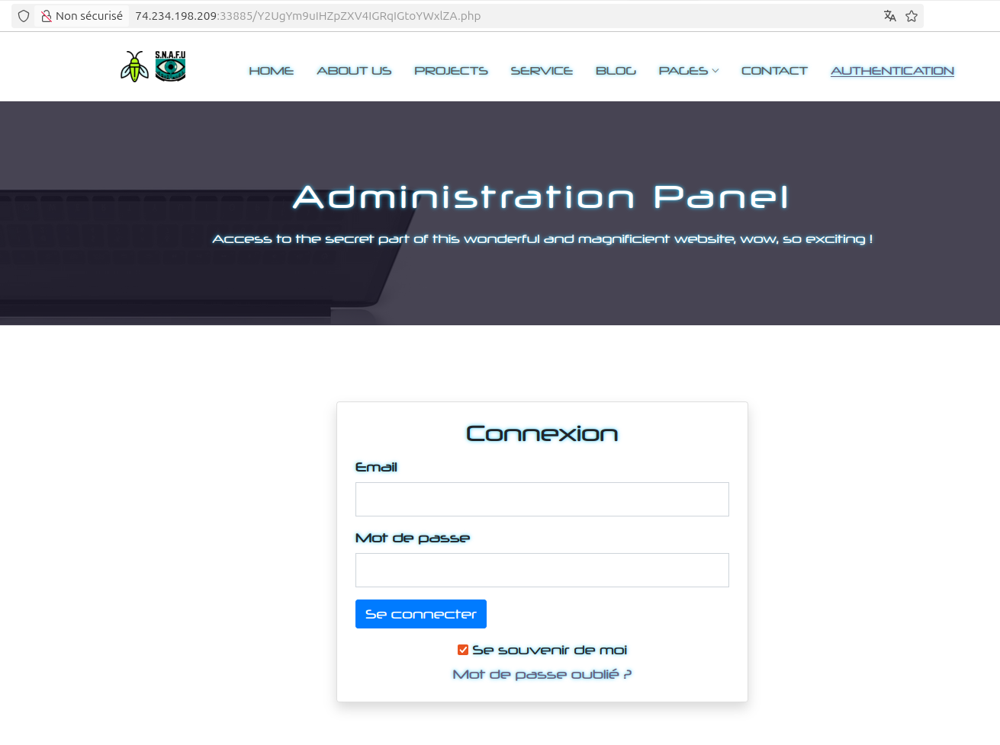
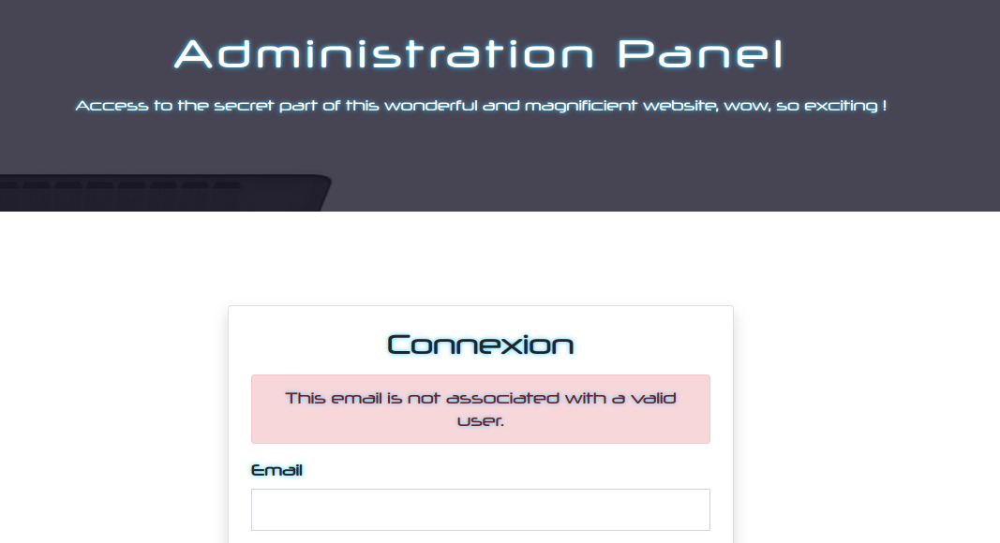

# Cicadya - Write-up
## Introduction
Here's the writeup of both challenges "Cicadya - Whos the boss?" and "Cicadya - Nice pic bro" that I created for the THCON 2025.\
I'll try to explain how to solve the challenge from the point of view of someone discovering it for the first time (with the creator's knowledge of course). Because I'm tired of challenge creators who go straight to the answer without explaining and detailing the process that led to solving the challenge.## Write-up.\
## Actual write-up

The website is a legit company's website so all the pages will be filled with bullshit company's information and description (generated by myself and chatGPT).\
Starting on the first page, on the bottom, we can find employee's quotes. We directly gather their name as it is always useful and keep the quotes in mind.\

We can notice `faq.php` and `contact.php` has the email of "Leila Stuart", an employee that can be found on the first page. 

We identify a specific email pattern : `<FIRST_LETTER_OF_FIRST_NAME><LAST_NAME>@cicadya.com`.\
With that in mind, we can generate a wordlist of email addresses with the name of employees we gathered.\
If we review the source code of `index.php`, we notice a link commented in the nav bar that leads to an authentication page.\

On this page, enumeration is possible on the email field as the page specify if the mail is associated to an user.\

We can "bruteforce" the email field with our email adresses wordlist and find that `ssaeed@cicadya.com and `jjhonson@cicadya.com are valid.\
At this step, you will realize that employees' quotes give us all the information we need to bypass the authentication.\
Indeed, we can guess with this quote only ssaeed has access, Jjhonson is unfortunately a rabbit hole.\

By these keywords, it is understanble that we have a SHA256 loose comparison (type juggling) exploit and that we need a sha256 magic hash to bypass authentication.
 
For those who don't know this vulnerability, if PHP uses "==" instead of "===" to compare elements, it can lead to surprising results as PHP try to convert elements in the same type.
For example, a string that begins with "0eX" will be treated as 0 exponent X and results in a float or comparing an integer with a string will give "True". Magic hashes are know string which passes through an algorithm give a hash that begins with 0e. In this authentication, Dr. SAEED password hash begin with 0e and it is compared to the hash of the user supplied password.
 
We get the first flag.
On the profile page, the "Description" field is a rabbit hole, you can't do anything with it.
The profile pic is our way ! But it blocks every executable extension (I make sure of that) and seems to only allow pictures extensions.
However, if you try uploading a file with an unconventional extension it works and is displayed in raw text :
 
In real world Apache based website wirh file upload functionality is it common to exploit a vulnerabilit  override the uplaod directory configuration by uploading an htaccess that will allow to interpret files with chosen extension as PHP file.
These technique can be found here :
 
So we upload the following htaccess file :
And upload a webshell with the extension we previously allowed :
 
We navigate to our file and gain RCE :
 
The flag is on the "/" directory.
